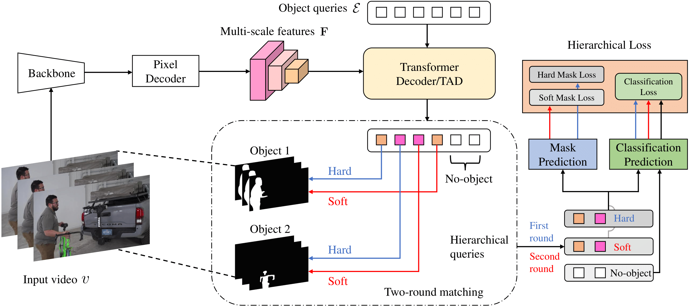

# THE-Mask
Official PyTorch implementation of BMVC 2023 paper: Temporal-aware Hierarchical Mask Classification for Video Semantic Segmentation [[`arXiv`](https://arxiv.org/abs/2309.08020)].

[Zhaochong An](https://zhaochongan.github.io/), [Guolei Sun](https://guoleisun.github.io/), [Zongwei Wu](https://sites.google.com/view/zwwu/accueil), [Hao Tang](https://ha0tang.github.io/), [Luc Van Gool](https://ee.ethz.ch/the-department/faculty/professors/person-detail.OTAyMzM=.TGlzdC80MTEsMTA1ODA0MjU5.html)

## Abstract
Modern approaches have proved the huge potential of addressing semantic segmentation as a mask classification task which is widely used in instance-level segmentation. This paradigm trains models by assigning part of object queries to ground truths via conventional one-to-one matching. However, we observe that the popular video semantic segmentation (VSS) dataset has limited categories per video, meaning less than 10% of queries could be matched to receive meaningful gradient updates during VSS training. This inefficiency limits the full expressive potential of all queries.Thus, we present a novel solution THE-Mask for VSS, which introduces temporal-aware hierarchical object queries for the first time. Specifically, we propose to use a simple two-round matching mechanism to involve more queries matched with minimal cost during training while without any extra cost during inference. To support our more-to-one assignment, in terms of the matching results, we further design a hierarchical loss to train queries with their corresponding hierarchy of primary or secondary. Moreover, to effectively capture temporal information across frames, we propose a temporal aggregation decoder that fits seamlessly into the mask-classification paradigm for VSS. Utilizing temporal-sensitive multi-level queries, our method achieves state-of-the-art performance on the latest challenging VSS benchmark VSPW without bells and whistles.





## Installation
Download this repository and install by:
```
cd THE-mask && pip install -e . --user
```

After preparing the required environment, run the following command to compile CUDA kernel for MSDeformAttn as in [Mask2Former](https://github.com/facebookresearch/Mask2Former/blob/main/INSTALL.md):

`CUDA_HOME` must be defined and points to the directory of the installed CUDA toolkit.

```bash
cd mmseg/models/decode_heads/mask2former/pixel_decoder/ops
sh make.sh
```

Other requirements (see `the_requirements.txt`):
```CUDA11.0, pytorch==1.7.1, torchvision==0.8.2, mmcv==1.3.0, detectron2==0.5+cu110```.

## Usage
### Data preparation
Please follow [VSPW](https://github.com/sssdddwww2/vspw_dataset_download) to download VSPW 480P dataset.
After correctly downloading, the file system is as follows:
```
VSPW_480p/data
├── video1
    ├── origin
        ├── .jpg
    └── mask
        └── .png
```
The dataset should be put in ```/repo_path/data/vspw/```. Or you can use Symlink: 
```
cd THE-mask
mkdir -p data/vspw/
ln -s /dataset_path/VSPW_480p data/vspw/
```

### Test
```
# Multi-gpu testing
./tools/dist_test.sh local_configs/themask/video_themask_mit_b1.py /path/to/checkpoint_file <GPU_NUM> --options data.test.test_size=<CLIP_LENGTH>
```

### Training
1. Download pretrained backbone weights [[onedrive](https://connecthkuhk-my.sharepoint.com/:f:/g/personal/xieenze_connect_hku_hk/EvOn3l1WyM5JpnMQFSEO5b8B7vrHw9kDaJGII-3N9KNhrg?e=cpydzZ)] (provided by SegFormer), and put the path to ```pretrained='/path/to/backbone/file'``` in the configs files under local_configs folder.

2. Training requires 4 Nvidia GPUs, each of which has > 20G GPU memory.
```
# firstly train THE-mask on the one-frame clips
./tools/dist_train.sh local_configs/themask/1f_themask_mit_b5.py <GPU_NUM> --work-dir /path/to/save_model_1f

# secondly train the model on the multiple-frame clips (e.g. two frames)
./tools/dist_train.sh local_configs/themask/video_themask_mit_b5.py <GPU_NUM> --work-dir /path/to/save_model --options model.decode_head.transformer_decoder_cfg.num_frames=2 data.train.dataset.dilation="[-3]" runner.max_iters=12000 checkpoint_config.interval=500 --finetune-from /path/to/save_model_1f
```

## License
This project is only for academic use.

## Acknowledgement
The code is heavily based on the following repositories:
- https://github.com/open-mmlab/mmsegmentation
- https://github.com/GuoleiSun/VSS-CFFM
- https://github.com/facebookresearch/Mask2Former

Thanks for their amazing works.

## Citation
```bibtex
@article{an2023temporal,
  title={Temporal-aware Hierarchical Mask Classification for Video Semantic Segmentation},
  author={An, Zhaochong and Sun, Guolei and Wu, Zongwei and Tang, Hao and Van Gool, Luc},
  year={2023}
}
```
## Contact
- Zhaochong An, anzhaochong@outlook.com
- Guolei Sun, sunguolei.kaust@gmail.com
